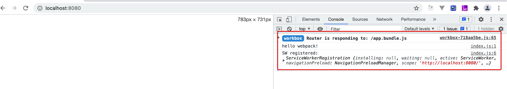

## 2.6 渐进式网络应用程序 PWA

渐进式网络应用程序(progressive web application - PWA)，是一种可以提供类似于 native app(原生应用程序) 体验的 web app(网络应用程序)。PWA 可以用来做很多事。其中最重要的是，在**离线(offline)**时应用程序能够继续运行功能。这是通过使用名为 [Service Workers](https://developers.google.com/web/fundamentals/primers/service-workers/) 的 web 技术来实现的。

### 2.6.1 非离线环境下运行

到目前为止，我们一直是直接查看本地文件系统的输出结果。通常情况下，真正的用户是通过网络访问 web app；用户的浏览器会与一个提供所需资源（例如，`.html`, `.js` 和 `.css` 文件）的 **server** 通讯。

我们通过搭建一个拥有更多基础特性的 server 来测试下这种离线体验。这里使用 [http-server](https://www.npmjs.com/package/http-server) package：`npm install http-server --save-dev`。还要修改 `package.json` 的 `scripts` 部分，来添加一个 `start` script：

**package.json**

```json
{
  ...
  "scripts": {
    "start": "http-server dist"
  },
  ...
}
```

注意：默认情况下，[webpack DevServer](https://webpack.docschina.org/configuration/dev-server/) 会写入到内存。我们需要启用 [devserverdevmiddleware.writeToDisk](https://webpack.docschina.org/configuration/dev-server/#devserverdevmiddleware) 配置项，来让 http-server 处理 `./dist` 目录中的文件。

```js
devServer: {
  devMiddleware: {
    index: true,
    writeToDisk: true,
  },
},
```

如果你之前没有操作过，先得运行命令 `npm run build` 来构建你的项目。然后运行命令 `npm start`。应该产生以下输出：

```bash
> http-server dist

Starting up http-server, serving dist
Available on:
  http://xx.x.x.x:8080
  http://127.0.0.1:8080
  http://xxx.xxx.x.x:8080
Hit CTRL-C to stop the server
```

如果你打开浏览器访问 `http://localhost:8080` (即 `http://127.0.0.1`)，你应该会看到 webpack 应用程序被 serve 到 `dist` 目录。如果停止 server 然后刷新，则 webpack 应用程序不再可访问。

这就是我们为实现离线体验所需要的改变。在本章结束时，我们应该要实现的是，停止 server 然后刷新，仍然可以看到应用程序正常运行。

### 2.6.2 添加 Workbox

添加 workbox-webpack-plugin 插件，然后调整 `webpack.config.js` 文件：

```bash
npm install workbox-webpack-plugin --save-dev
```

**webpack.config.js**

```js
const path = require('path');
const HtmlWebpackPlugin = require('html-webpack-plugin');
const WorkboxPlugin = require('workbox-webpack-plugin');

module.exports = {
  entry: {
    app: './src/index.js',
  },
  plugins: [
    new HtmlWebpackPlugin(),
    new WorkboxPlugin.GenerateSW({
      // 这些选项帮助快速启用 ServiceWorkers
      // 不允许遗留任何“旧的” ServiceWorkers
      clientsClaim: true,
      skipWaiting: true,
    }),
  ],
  output: {
    filename: '[name].bundle.js',
    path: path.resolve(__dirname, 'dist'),
    clean: true,
  },
}
```

执行：`npx webpack`

```shell
[felix] 06-pwa $ npx webpack
assets by status 121 KiB [emitted]
  asset workbox-718aa5be.js 118 KiB [emitted]
  asset service-worker.js 3.23 KiB [emitted]
assets by status 1.44 KiB [compared for emit]
  asset app.bundle.js 1.21 KiB [compared for emit] (name: app)
  asset index.html 237 bytes [compared for emit]
./src/index.js 29 bytes [built] [code generated]

LOG from GenerateSW
<i> The service worker at service-worker.js will precache
<i>         2 URLs, totaling 1.47 kB.

webpack 5.61.0 compiled successfully in 1140 ms
```

现在你可以看到，生成了两个额外的文件：`service-worker.js` 和名称冗长的 `workbox-718aa5be.js`。`service-worker.js` 是 Service Worker 文件，`workbox-718aa5be.js` 是 `service-worker.js` 引用的文件，所以它也可以运行。你本地生成的文件可能会有所不同；但是应该会有一个 `service-worker.js` 文件。

所以，值得高兴的是，我们现在已经创建出一个 Service Worker。接下来该做什么？

### 2.6.3 注册 Service Worker

接下来我们注册 Service Worker，使其出场并开始表演。通过添加以下注册代码来完成此操作：

**index.js**

````js
## 2.6 渐进式网络应用程序 PWA

渐进式网络应用程序(progressive web application - PWA)，是一种可以提供类似于 native app(原生应用程序) 体验的 web app(网络应用程序)。PWA 可以用来做很多事。其中最重要的是，在**离线(offline)**时应用程序能够继续运行功能。这是通过使用名为 [Service Workers](https://developers.google.com/web/fundamentals/primers/service-workers/) 的 web 技术来实现的。

### 2.6.1 非离线环境下运行

到目前为止，我们一直是直接查看本地文件系统的输出结果。通常情况下，真正的用户是通过网络访问 web app；用户的浏览器会与一个提供所需资源（例如，`.html`, `.js` 和 `.css` 文件）的 **server** 通讯。

我们通过搭建一个拥有更多基础特性的 server 来测试下这种离线体验。这里使用 [http-server](https://www.npmjs.com/package/http-server) package：`npm install http-server --save-dev`。还要修改 `package.json` 的 `scripts` 部分，来添加一个 `start` script：

**package.json**

```json
{
  ...
  "scripts": {
    "start": "http-server dist"
  },
  ...
}
```

注意：默认情况下，[webpack DevServer](https://webpack.docschina.org/configuration/dev-server/) 会写入到内存。我们需要启用 [devserverdevmiddleware.writeToDisk](https://webpack.docschina.org/configuration/dev-server/#devserverdevmiddleware) 配置项，来让 http-server 处理 `./dist` 目录中的文件。

```js
devServer: {
  devMiddleware: {
    index: true,
    writeToDisk: true,
  },
},
```

如果你之前没有操作过，先得运行命令 `npm run build` 来构建你的项目。然后运行命令 `npm start`。应该产生以下输出：

```bash
> http-server dist

Starting up http-server, serving dist
Available on:
  http://xx.x.x.x:8080
  http://127.0.0.1:8080
  http://xxx.xxx.x.x:8080
Hit CTRL-C to stop the server
```

如果你打开浏览器访问 `http://localhost:8080` (即 `http://127.0.0.1`)，你应该会看到 webpack 应用程序被 serve 到 `dist` 目录。如果停止 server 然后刷新，则 webpack 应用程序不再可访问。

这就是我们为实现离线体验所需要的改变。在本章结束时，我们应该要实现的是，停止 server 然后刷新，仍然可以看到应用程序正常运行。

### 2.6.2 添加 Workbox

添加 workbox-webpack-plugin 插件，然后调整 `webpack.config.js` 文件：

```bash
npm install workbox-webpack-plugin --save-dev
```

**webpack.config.js**

```js
const path = require('path');
const HtmlWebpackPlugin = require('html-webpack-plugin');
const WorkboxPlugin = require('workbox-webpack-plugin');

module.exports = {
  entry: {
    app: './src/index.js',
  },
  plugins: [
    new HtmlWebpackPlugin(),
    new WorkboxPlugin.GenerateSW({
      // 这些选项帮助快速启用 ServiceWorkers
      // 不允许遗留任何“旧的” ServiceWorkers
      clientsClaim: true,
      skipWaiting: true,
    }),
  ],
  output: {
    filename: '[name].bundle.js',
    path: path.resolve(__dirname, 'dist'),
    clean: true,
  },
}
```

执行：`npx webpack`

```shell
[felix] 06-pwa $ npx webpack
assets by status 121 KiB [emitted]
  asset workbox-718aa5be.js 118 KiB [emitted]
  asset service-worker.js 3.23 KiB [emitted]
assets by status 1.44 KiB [compared for emit]
  asset app.bundle.js 1.21 KiB [compared for emit] (name: app)
  asset index.html 237 bytes [compared for emit]
./src/index.js 29 bytes [built] [code generated]

LOG from GenerateSW
<i> The service worker at service-worker.js will precache
<i>         2 URLs, totaling 1.47 kB.

webpack 5.61.0 compiled successfully in 1140 ms
```

现在你可以看到，生成了两个额外的文件：`service-worker.js` 和名称冗长的 `workbox-718aa5be.js`。`service-worker.js` 是 Service Worker 文件，`workbox-718aa5be.js` 是 `service-worker.js` 引用的文件，所以它也可以运行。你本地生成的文件可能会有所不同；但是应该会有一个 `service-worker.js` 文件。

所以，值得高兴的是，我们现在已经创建出一个 Service Worker。接下来该做什么？

### 2.6.3 注册 Service Worker

接下来我们注册 Service Worker，使其出场并开始表演。通过添加以下注册代码来完成此操作：

**index.js**

```js
//...

if ('serviceWorker' in navigator) {
  window.addEventListener('load', () => {
    navigator.serviceWorker.register('/service-worker.js').then(registration => {
      console.log('SW registered: ', registration);
    }).catch(registrationError => {
      console.log('SW registration failed: ', registrationError);
    });
  });
}
```

再次运行 `npx webpack` 来构建包含注册代码版本的应用程序。然后用 `npm start` 启动服务。访问 `http://localhost:8080` 并查看 console 控制台。在那里你应该看到：

```bash
SW registered
```

现在来进行测试。停止 server 并刷新页面。如果浏览器能够支持 Service Worker，应该可以看到你的应用程序还在正常运行。然而，server 已经**停止** serve 整个 dist 文件夹，此刻是 Service Worker 在进行 serve。




## //...

if ('serviceWorker' in navigator) {
  window.addEventListener('load', () => {
    navigator.serviceWorker.register('/service-worker.js').then(registration => {
      console.log('SW registered: ', registration);
    }).catch(registrationError => {
      console.log('SW registration failed: ', registrationError);
    });
  });
}
````

再次运行 `npx webpack` 来构建包含注册代码版本的应用程序。然后用 `npm start` 启动服务。访问 `http://localhost:8080` 并查看 console 控制台。在那里你应该看到：

```bash
SW registered
```

现在来进行测试。停止 server 并刷新页面。如果浏览器能够支持 Service Worker，应该可以看到你的应用程序还在正常运行。然而，server 已经**停止** serve 整个 dist 文件夹，此刻是 Service Worker 在进行 serve。


## 